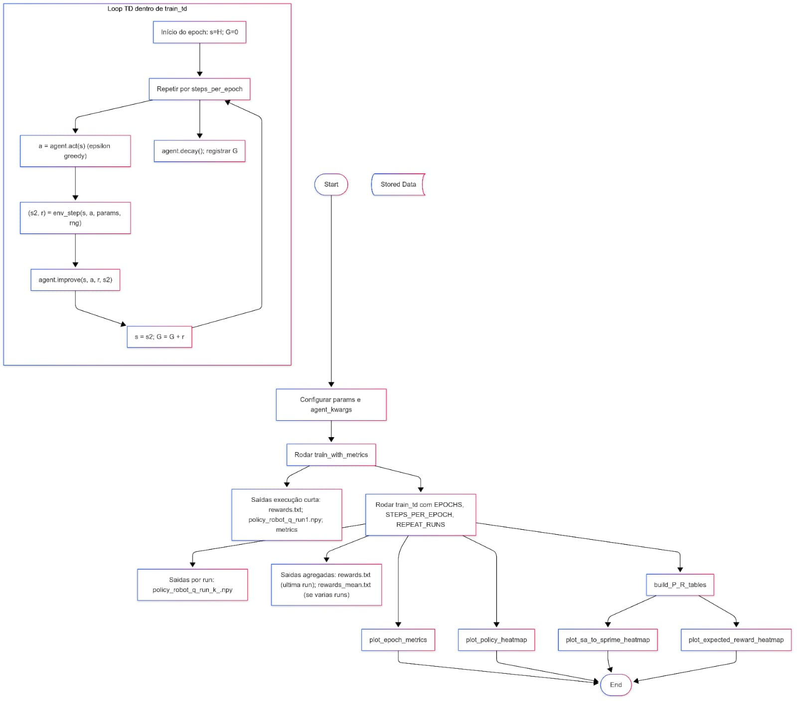
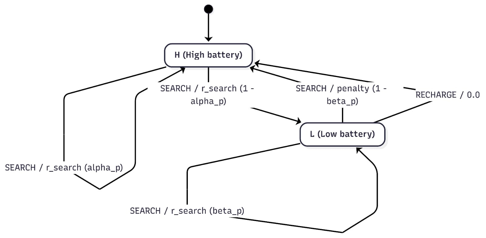
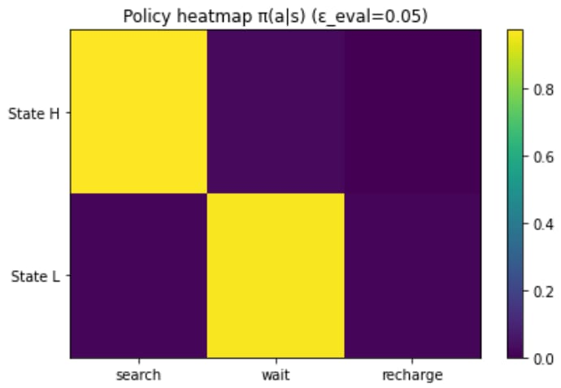
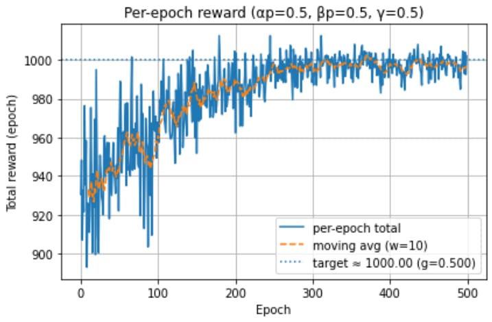
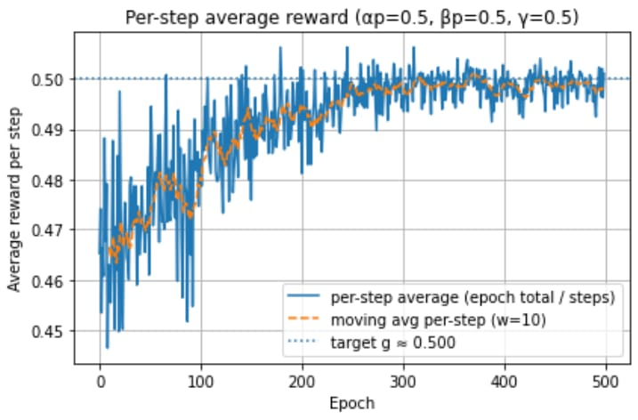
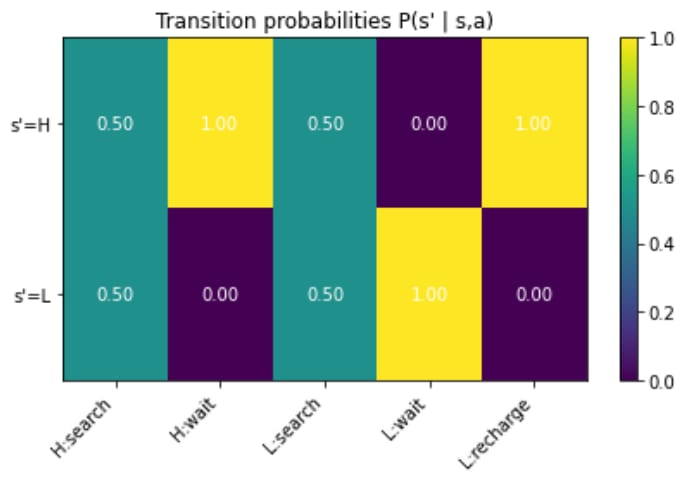

# Projeto: Recycling Robot

> MDP do robô de reciclagem (Sutton & Barto) — código + explicação.

- **Objetivo:** Demonstrar a dinâmica de estados/ações e políticas no MDP do robô.
- **Entrada/Saída:** Sequências de estados, ações válidas e recompensas simuladas.
- **Tecnologias:** Python (NumPy, Matplotlib), Mermaid para diagramas (renderizado no GitHub).

---

## Sumário
- [1. Introdução](#1-introdução)
- [2. Explicação do Código](#2-explicação-do-código)
  - [2.1 Dependências](#21--dependências)
  - [2.2 Definição de Variáveis](#22--definição-de-variáveis)
  - [2.3 Física do Ambiente / Ações Válidas](#23--física-do-ambiente--ações-válidas)
  - [2.4 Física do agente e TD (Temporal-Difference)](#24--física-do-agente-e-TD)
  - [2.5 Treinamento da IA](#25--treinamento-da-IA)
  - [2.6 Loggings e Plots](#26--loggings-e-plots)
  - [2.7 Otimização das funções de valor (state/action)](#27--otimização-das-funções-de-valor-(state/action))
  - [2.8 Bloco principal](#28--bloco-principal)
- [3. Diagramas](#3-diagramas)
  - [3.1 Fluxo de Execução](#31-fluxo-de-execução)
  - [3.2 Diagrama de Estados do MDP](#32-diagrama-de-estados-do-mdp)
- [4. Execução de Exemplo](#4-execução-de-exemplo)
- [5. Resultados & Notas](#5-resultados--notas)
- [6. Referências](#6-referências)

---

## 1. Introdução
Este repositório contém um exemplo do **Recycling Robot** como um MDP com dois estados `H` (alto) e `L` (baixo), e ações `search`, `wait`, `recharge`. O foco é **explicar** o código e **visualizar** a lógica com diagramas.

---

## 2. Explicação do Código

### 2.1 -  Dependências
```python
import numpy as np
import matplotlib.pyplot as plt
import os
from dataclasses import dataclass
import time
```

### 2.2 -  Definição de variáveis

```python
try:
    import seaborn as sns
    HAS_SNS = True
except Exception: 
    HAS_SNS = False
    
# States
H, L = 0, 1
STATE_NAMES = {H: "H", L: "L"}

# Actions
SEARCH, WAIT, RECHARGE = 0, 1, 2
ACTION_NAMES ={SEARCH: "search", WAIT: "wait", RECHARGE: "recharge"}

# Valid actions by states
ACTIONS_H = (SEARCH, WAIT)                  # In H you cannot recharge 
ACTIONS_L = (SEARCH, WAIT, RECHARGE)

# Constants
STEPS_PER_EPOCH = 2000
EPOCHS = 500
REPEAT_RUNS = 5
```
---
```python
@dataclass
class Params: 
    alpha_p: float = 0.9
    beta_p: float = 0.9
    r_search: float = 1.0
    r_wait: float = 0.0
    penalty: float = -3
    gamma: float = 0.9
    def __post_init__(self):
        assert self.r_search > self.r_wait, "Spec requires r_search > r_wait"
        assert 0.0 <= self.gamma < 1.0, "Discount factor gamma must be in [0,1)"
        assert  0.0 <= self.alpha_p <= 1.0 and 0.0 <= self.beta_p <= 1
```
---


### 2.3 – Física do ambiente / Ações válidas — **contexto e escolhas de design**

Este trecho define a **dinâmica do ambiente** do Recycling Robot como um **MDP** (Processo de Decisão de Markov).  
Ele provê:

- `env_step(state, action, p, rng)`: dado o estado `s` e a ação `a`, **amostra** o próximo estado `s'` e retorna a **recompensa imediata** `r`.  
- `valid_actions(state)`: informa **quais ações são permitidas** em cada estado (ex.: `RECHARGE` é proibida em `H`).

#### Por que esse desenho? (decisões de design)
- **Separação clara Agente × Ambiente.** Toda a lógica de transição e recompensa fica no **ambiente**; o **agente** (SARSA/Q-learning) aprende apenas a partir de amostras `(s, a, r, s')`. Isso torna o código modular, testável e alinhado ao padrão de RL (Sutton & Barto).
- **Estocástico onde importa; determinístico onde faz sentido.**  
  `SEARCH` usa probabilidades `alpha_p` (em `H`) e `beta_p` (em `L`) via `rng.random()` para modelar a incerteza do consumo da bateria; `WAIT` e `RECHARGE` têm transições determinísticas.
- **Reprodutibilidade por injeção de RNG.** O gerador aleatório `np.random.Generator` é **injetado** (sem globais ocultos), permitindo *seeds* e experimentos repetíveis.
- **Parâmetros centralizados.** A `dataclass Params` concentra probabilidades e recompensas (`r_search`, `r_wait`, `penalty`, `gamma`), facilitando **ablação** e **simulações** sem tocar na lógica.
- **Ações legais garantidas.**  
  `valid_actions(state)` restringe a política ao que é permitido; ainda assim, `env_step` lança `ValueError` em combinações inválidas (*defensive programming*).
- **Tarefa contínua (horizonte infinito).** Não há estado terminal; o desconto `γ` é tratado no **agente** (nas atualizações TD), não no ambiente.

#### Intuição do trade-off
- **`SEARCH`**: dá recompensa positiva, mas pode **degradar** a bateria (risco de sair de `H`→`L` ou acabar em `L` e pagar `penalty`).  
- **`WAIT`**: recompensa menor do que r_search (ou zero), mantém o estado (segurança).  
- **`RECHARGE`**: recompensa imediata zero, mas restaura a bateria para `H`, permitindo buscas futuras mais seguras.  
> O agente aprende a equilibrar **colher agora** vs. **conservar/recarregar** para maximizar retorno de longo prazo.

#### Referência rápida das transições (conceito)
| (Estado, Ação) | Próximo estado(s) & prob.               | Recompensa |
|---|---|---|
| (H, SEARCH)    | `H` com **α** (= `alpha_p`), `L` com **1−α** | `r_search` |
| (H, WAIT)      | `H` (determinístico)                    | `r_wait`   |
| (L, SEARCH)    | `L` com **β** (= `beta_p`), `H` com **1−β** (depleção) | `r_search` (se ficar em `L`) / `penalty` (se ir a `H`) |
| (L, WAIT)      | `L` (determinístico)                    | `r_wait`   |
| (L, RECHARGE)  | `H` (determinístico)                    | `0.0`      |

**TL;DR:** Este bloco implementa \( P(s', r \mid s, a) \) do MDP de forma compacta e segura, separando responsabilidades e refletindo as incertezas reais do robô ao buscar, esperar ou recarregar.

	
```python
def env_step(state: int, action: int, p: Params, rng: np.random.Generator):
    """Sample (next_state, reward) from Sutton's recycling robot MDP."""
    if state == H:
        if action == SEARCH:
            # Always get r_search; remain H with prob alpha_p, else go to L
            rew = p.r_search
            next_state = H if rng.random() < p.alpha_p else L
            return next_state, rew
        elif action == WAIT:
            # Stay in H, reward r_wait
            return H, p.r_wait
        else:
            raise ValueError("RECHARGE is invalid in state H")
    else: # State L
        if action == SEARCH:
            # With prob beta_p: stay L, get r_search
            # With prob 1 - beta_p: deplete -> go to H with penalty
            if rng.random() < p.beta_p:
                return L, p.r_search
            else:
                return H, p.penalty
        elif action == WAIT: 
            return L, p.r_wait
        elif action == RECHARGE:
            return H, 0.0
        else:
            raise ValueError("Invalid action code")
```

```python
def valid_actions(state: int):
    return ACTIONS_H if state == H else ACTIONS_L
```

---
### 2.4 – Física do agente e TD (Temporal-Difference): **contexto e escolhas de design**

Este bloco implementa um **agente de Controle TD** capaz de aprender políticas por **SARSA (on-policy)** ou **Q-learning (off-policy)** sobre a mesma tabela \(Q(s,a)\) de dimensão **2×3** (2 estados × 3 ações).

#### O que o agente faz (visão geral)

- Mantém uma **tabela \(Q\)** `self.Q` com os valores-ação.
- Escolhe ações por **\(\varepsilon\)-greedy**: com probabilidade \(\varepsilon\) **explora**; com \(1-\varepsilon\) **aproveita** \(\operatorname*{arg\,max}_{a \in \mathcal{A}(s)} Q(s,a)\) **apenas** entre ações válidas (`valid_actions(state)`).
- Atualiza \(Q\) por **TD**:
  - **SARSA (on-policy):**
    $$
    \text{target} = r + \gamma\, Q(s', a'), \quad a' \sim \pi_{\varepsilon}\ \ (\text{mesma política})
    $$
  - **Q-learning (off-policy):**
    $$
    \text{target} = r + \gamma \max_{a' \in \mathcal{A}(s')} Q(s', a')
    $$
  - **Erro TD:** \(\delta = \text{target} - Q(s,a)\)  
  - **Atualização:** \(Q(s,a) \leftarrow Q(s,a) + \alpha\,\delta\)
- **Decaimento de \(\varepsilon\):** \(\varepsilon \leftarrow \max(\varepsilon_{\min},\ \varepsilon \cdot \text{decay})\).  
  Com o tempo, **diminui a exploração** e **aumenta o aproveitamento (greedy)**.


#### Escolhas de design importantes
- **Ações inválidas “existem” na Q-table, mas nunca são escolhidas.**  
  Mantemos a Q-table fixa (2×3) por simplicidade e compatibilidade com o resto do código; a função `valid_actions(state)` garante que `act()` só considere ações legais em cada estado. Ainda assim, manter a coluna “inútil” evita condicionais e reshape ao longo do pipeline.
- **Empate no argmax** com ruído leve.**  
  Em `act()`, um ruído minúsculo quebra empates aleatoriamente, evitando viés sistemático quando \(Q\) tem valores iguais.
- **RNG injetado e `seed` controlado.**  
  O agente cria seu próprio `np.random.Generator` (`self.rng`), garantindo **reprodutibilidade** (seeds) e separação limpa de fontes de aleatoriedade.
- **On-policy vs Off-policy em uma só classe.**  
  O parâmetro `method` alterna o **alvo TD** sem duplicar código. Isso permite comparar rapidamente estabilidade (SARSA) vs. velocidade/otimismo (Q-learning).
- **Política de avaliação separada** (`policy_probs(epsilon_eval)`).  
  Constrói \( \pi(a\mid s) \) **para avaliação/visualização** (ex.: heatmap), com \(\varepsilon\) **de avaliação** (não o de treino).  
  Invariantes: probabilidades somam 1 **apenas** sobre ações válidas; inválidas recebem 0.

#### Hiperparâmetros e seus papéis
- `alpha` (\(\alpha\)): **taxa de aprendizado**. Valores maiores aprendem rápido, mas podem oscilar; valores menores são mais estáveis.
- `epsilon`, `epsilon_min`, `epsilon_decay`: controlam o **equilíbrio exploração/aproveitamento** ao longo do tempo.
- `gamma` (\(\gamma\), vem de `Params`): **desconto** de recompensas futuras; define o horizonte efetivo.

#### Por que isso funciona bem aqui
- O ambiente é **pequeno** (2×3), logo **tabular** é a escolha natural (sem redes neurais).
- A separação **ambiente ↔ agente** permanece clara: o agente só vê transições \((s,a,r,s')\).
- `policy_probs` facilita **interpretação**: você consegue inspecionar a política aprendida com \(\varepsilon\) de avaliação (p.ex., 0 ou 0.05) sem “contaminar” o treino.

**TL;DR:** uma implementação enxuta de **Controle TD** que alterna entre **SARSA** e **Q-learning**, usa **ε-greedy** restrito a ações válidas, garante reprodutibilidade e oferece ferramentas para **salvar/carregar** a política e **visualizá-la** de forma consistente.


```python
# ------------------ Agent: TD Control (SARSA or Q-learning) ------------------

class Agent:
    def __init__(self, params: Params,
                 alpha=0.2, epsilon=0.2, epsilon_min=0.01, epsilon_decay=0.9995,
                 method="qlearning", seed=0):
        """
        method: 'sarsa' (on-policy) or 'qlearning' (off-policy)
        """
        self.params = params
        self.alpha = float(alpha)
        self.epsilon = float(epsilon)
        self.epsilon_min = float(epsilon_min)
        self.epsilon_decay = float(epsilon_decay)
        self.method = method.lower()
        assert self.method in ("sarsa", "qlearning")
        # Q-table for 2 states x 3 actions; invalid actions kept but never chosen
        self.Q = np.zeros((2, 3), dtype=float)
        self.rng = np.random.default_rng(seed)

    def act(self, state: int):
        """ε-greedy action selection restricted to valid actions."""
        acts = valid_actions(state)
        if self.rng.random() < self.epsilon:
            return self.rng.choice(acts)
        # exploit: argmax Q(s,a) over valid actions; break ties randomly
        qs = np.array([self.Q[state, a] for a in acts])
        # random tie-break: add tiny noise
        a_idx = int(np.argmax(qs + 1e-9 * self.rng.standard_normal(qs.shape)))
        return acts[a_idx]

    def improve(self, s, a, r, s2):
        """One TD update (SARSA or Q-learning)."""
        if self.method == "sarsa":
            # on-policy: next action follows current ε-greedy policy
            a2 = self.act(s2)
            target = r + self.params.gamma * self.Q[s2, a2]
        else:
            # Q-learning: bootstrap with max_a' Q(s', a')
            acts2 = valid_actions(s2)
            target = r + self.params.gamma * np.max(self.Q[s2, acts2])

        td_error = target - self.Q[s, a]
        self.Q[s, a] += self.alpha * td_error

    def decay(self):
        self.epsilon = max(self.epsilon_min, self.epsilon * self.epsilon_decay)

    # --- utilities to persist / inspect policy ---
    def save_policy(self, path="policy_robot_q.npy"):
        np.save(path, self.Q)

    def load_policy(self, path="policy_robot_q.npy"):
        self.Q = np.load(path)

    def policy_probs(self, epsilon_eval=0.0):
        """
        Build π(a|s) matrix (2x3) under ε-greedy w.r.t. Q with evaluation epsilon.
        Invalid actions get probability 0.
        """
        P = np.zeros((2, 3), dtype=float)
        for s in (H, L):
            acts = valid_actions(s)                 # H → (SEARCH, WAIT), L → (SEARCH,WAIT,RECHARGE)
            qs = np.array([self.Q[s, a] for a in acts])

            maxq = np.max(qs)                       # best Q among valid actions
            greedy_mask = (qs >= maxq - 1e-12)      # allow ties (within numerical tolerance)
            n_greedy = int(np.sum(greedy_mask))     # how many actions tie for best?
            k = len(acts)                           # number of valid actions in this state
            eps = float(epsilon_eval)               # eval-time epsilon (not training epsilon!)

            # Start with uniform exploration mass: ε/k on every valid action
            base = eps / k
            P_row = np.full(k, base, dtype=float)

            # Put (1-ε) exploitation mass evenly on the greedy set (split if tie)
            P_row[greedy_mask] += (1.0 - eps) / n_greedy

            # Write the row back into the 2x3 matrix at the proper action columns
            for idx, a in enumerate(acts):
                P[s, a] = P_row[idx]
        return P
```

---

### 2.5 – Treinamento da IA — visão geral e escolhas de design

`train_td(...)` executa o **loop de aprendizagem TD** (SARSA ou Q-learning) por um número fixo de epochs, medindo o **retorno por epoch** e salvando artefatos para análise.

#### O que a função faz
- **Configura o agente** (`Agent(...)`) com hiperparâmetros de treino (`alpha`, `epsilon`, `epsilon_decay`, etc.) e um **RNG** próprio (seed controlada).
- **Repete o treino** `repeat_runs`  n vezes (com seeds deslocadas) para obter **curvas mais estáveis** e salvar uma **política por run** (`policy_robot_q_run{n}.npy`).
- Em cada **epoch**:
  1. Define o **estado inicial** `s = H` (opção comum; há um *snippet* comentado para inicialização aleatória).
  2. Zera o acumulador `G` (retorno **não descontado** da época).
  3. Para `steps_per_epoch` passos:
     - escolhe ação `a` por **ε-greedy** (restrito a `valid_actions(s)`),
     - interage com o ambiente: `(s2, r) = env_step(s, a, params, rng)`,
     - aplica **TD update**: `agent.improve(s, a, r, s2)`,
     - acumula recompensa: `G += r`,
     - avança estado: `s = s2`.
  4. **Decai o ε**: `epsilon ← max(epsilon_min, epsilon * epsilon_decay)`  
     → tende de **exploração** para **aproveitamento (greedy)** ao longo do treino.
  5. Armazena `G` na lista `rewards_per_epoch`.
  6. (Log) imprime um **marco** a cada ~10% das épocas.
- **Após cada run**: salva a **Q-table** aprendida (`policy_robot_q_run{run}.npy`) e empilha o vetor de recompensas dessa run em `all_runs`.
- **Saída em disco**:
  - `rewards.txt`: **sempre** salva a curva **da última run** (um valor por linha).
  - Se `repeat_runs > 1`: também salva a **média** entre runs em `rewards_mean.txt`.
- **Valor de retorno da função**:
  - Se `repeat_runs == 1`: retorna o vetor de recompensas da única run.
  - Caso contrário: retorna a **média** das curvas.

> **Observação:** o retorno por epoch `G` é **não descontado**; o desconto `γ` atua **apenas** dentro do **update TD** (no alvo), não na soma `G`.

#### Por que esse desenho
- **Epochs de tamanho fixo (continuing task).** Não há terminais; usamos *janelas* de `steps_per_epoch` para medir progresso e visualizar convergência.
- **Reprodutibilidade**: seeds separadas para agente e ambiente (`seed + run` e `seed + 10_000 + run`), evitando correlação indesejada.
- **Avaliação simples**: salvar `rewards.txt` e `policy_robot_q_run{n}.npy` integra com os *plots* e *heatmaps* das seções seguintes.

```python
# ------------------ Training ------------------

def train_td(epochs=50, steps_per_epoch=1000,
             params=Params(alpha_p=0.9, beta_p=0.9, r_search=1.0, r_wait=0.0, penalty=-3.0, gamma=0.9),
             alpha=0.2, epsilon=0.3, epsilon_min=0.01, epsilon_decay=0.9995,
             method="qlearning", seed=42, rewards_file="rewards.txt",
             repeat_runs=1, avg_out="rewards_mean.txt"):
    """
    Trains for 'epochs', each epoch = 'steps_per_epoch' transitions.
    Saves total reward per epoch to rewards.txt (one number per line).
    If repeat_runs > 1, averages runs and saves to rewards_mean.txt.
    """
    all_runs = []
    for run in range(repeat_runs):
        agent = Agent(params, alpha, epsilon, epsilon_min, epsilon_decay, method, seed + run)
        rng = np.random.default_rng(seed + 10_000 + run)
        rewards_per_epoch = []

        for ep in range(1, epochs + 1):
            s = H  # start from High battery every epoch (common choice)
            G = 0.0
            # Optional: sample a random start: s = int(rng.random() < 0.5)
            for _ in range(steps_per_epoch):
                a = agent.act(s)
                s2, r = env_step(s, a, params, rng)
                agent.improve(s, a, r, s2)
                s = s2
                G += r
            agent.decay()
            rewards_per_epoch.append(G)
            if ep % max(1, (epochs // 10)) == 0:
                print(f"[run {run+1}/{repeat_runs}] epoch {ep}/{epochs} | total reward={G:.3f} | eps={agent.epsilon:.3f}", flush=True)

        all_runs.append(np.array(rewards_per_epoch, dtype=float))
        # Save last run's Q for inspection
        agent.save_policy(f"policy_robot_q_run{run+1}.npy")

    # Save rewards.txt (by spec) for the LAST run
    np.savetxt(rewards_file, all_runs[-1], fmt="%.6f")

    # If multiple runs, also save mean across runs
    if repeat_runs > 1:
        mean_curve = np.mean(np.vstack(all_runs), axis=0)
        np.savetxt(avg_out, mean_curve, fmt="%.6f")
        print(f"Saved mean curve to {avg_out}", flush=True)

    print(f"Saved last-run rewards to {rewards_file}", flush=True)
    return all_runs[-1] if repeat_runs == 1 else np.mean(np.vstack(all_runs), axis=0)
```

---

### 2.6 – Loggings e Plots — **o que é, por que existe e como ler**

Esta seção **não treina** o agente: ela **mede, reconstrói e visualiza** o que foi aprendido.  
Você ganha 3 coisas principais:

1) **Alvo teórico aproximado** a partir da **política "greedy" aprendida** (linha‐guia nos gráficos).  
2) **Gráficos de aprendizado** por epoch (total e média por passo).  
3) **Mapas/heatmaps** para inspecionar política e dinâmica do MDP.

---

#### A) Medindo o que a política aprendida “promete”
Funções: `greedy_policy_from_Q`, `transition_reward_under_policy`, `stationary_distribution`, `avg_reward_of_policy`.

- **`greedy_policy_from_Q(Q)`**  
  Extrai a **política greedy** \(\pi_{\text{greedy}}\) da tabela \(Q\):  
  - Em `H`, escolhe `argmax` entre **SEARCH/WAIT**.  
  - Em `L`, escolhe `argmax` entre **SEARCH/WAIT/RECHARGE**.  
  *Obs.:* Mantemos a Q-table 2×3 mesmo com ações inválidas; aqui só consultamos as **válidas**.

- **`transition_reward_under_policy(p, policy)`** → **\(P\) e \(R\) induzidos por \(\pi\)**  
  Constrói:
  - Uma **matriz de transição** \(P \in \mathbb{R}^{2\times 2}\) tal que \(P[s,s'] = \Pr(s' \mid s,\pi(s))\).  
  - Um **vetor de recompensa imediata média por estado** \(R \in \mathbb{R}^{2}\), consistente com a ação que \(\pi\) toma naquele estado.  
  Exemplos:  
  - Se \(\pi(H)=\text{SEARCH}\), então \(P(H,H)=\alpha_p\), \(P(H,L)=1-\alpha_p\), \(R(H)=r_{\text{search}}\).  
  - Se \(\pi(L)=\text{SEARCH}\), \(R(L)=r_{\text{search}}\cdot\beta_p + \text{penalty}\cdot(1-\beta_p)\) (média dos dois resultados possíveis).

- **`stationary_distribution(P)`** → **\(\pi_{\text{stat}}\)**  
  Resolve o sistema:
  \[
    \pi_{\text{stat}}^\top P = \pi_{\text{stat}}^\top,\quad \sum_s \pi_{\text{stat}}(s)=1
  \]
  para obter a **distribuição estacionária** da cadeia de Markov sob \(\pi\).  
  Implementação: resolve uma LSQ (least squares) com a equação de fluxo + normalização.

- **`avg_reward_of_policy(p, policy)`** → **\(g\)**  
  Calcula a **recompensa média por passo** sob a política aprendida:
  \[
    g \;=\; \pi_{\text{stat}}^\top R
  \]
  Este \(g\) é a base da **linha‐alvo** nos gráficos (seção B).

---

#### B) Gráficos de aprendizado: entender se a curva converge
Função: `plot_epoch_metrics(...)`

- **Entrada principal:** `rewards.txt` (uma linha por epoch) gerado em `train_td`.  
- **Média móvel:** usa convolução com janela `window` para **suavizar** a curva (variável `mov`).
- **Linha‐alvo (opcional):** se `params` e `Q_path` existem, calcula:
  - \(\pi_{\text{greedy}}\) ← `greedy_policy_from_Q(Q)`  
  - \(g\) ← `avg_reward_of_policy(params, π)` (**recompensa média por passo**)  
  - **Alvo por epoch** \(\approx g \times \text{steps\_per\_epoch}\) → desenha uma **linha horizontal**.  
  Interpretação: se o treino convergiu para algo próximo da política "greedy" atual, a **média móvel** da recompensa por epoch tende a estabilizar **perto** dessa linha.

O gráfico é mostrado em **duas vistas**:
1. **Total por epoch** (e a **média móvel**).  
2. **Média por passo** do epoch (`total/steps_per_epoch`) — deve se aproximar de \(g\).

> ⚠️ **Sutileza importante:** a **linha‐alvo** usa a **política greedy do arquivo Q** no momento do *plot*; se você ainda está treinando/alterando Q, a linha é **uma aproximação** de “onde deveríamos chegar” dado o que está salvo.

---

#### C) Heatmap da política aprendida (probabilidades de ação)
Função: `plot_policy_heatmap(Q_path, epsilon_eval)`

- Carrega `Q` e usa `agent.policy_probs(epsilon_eval)` para construir uma matriz **2×3** com \(\pi(a\mid s)\) sob **ε-greedy de avaliação** (normalmente `epsilon_eval` pequeno, ex.: 0.05).
- **Máscara de ação inválida:** se `seaborn` estiver disponível, máscara **RECHARGE em H** (inexistente), deixando a figura mais legível.
- **Quando usar:** depois de treinar, escolha `epsilon_eval` baixo para ver a política **quasi-greedy**, mas ainda com chance mínima de qualquer ação válida.

---

#### D) Visualizando a dinâmica \(P(s'\mid s,a)\) 
Funções: `build_P_R_tables`, `plot_sa_to_sprime_heatmap`

- **`build_P_R_tables(p)`**  
  Constrói:
  - `P_sa`: tensor \(2 \times 3 \times 2\) com \(P(s' \mid s,a)\) **por par (s,a)**.  
  - `R_sa`: matriz \(2 \times 3\) com \(E[r\mid s,a]\) **por par (s,a)**.  
  Preenchimento segue a definição do MDP:
  - **H, SEARCH:** \(P(H)=\alpha_p,\ P(L)=1-\alpha_p,\ R=r_{\text{search}}\).  
  - **H, WAIT:** \(P(H)=1,\ R=r_{\text{wait}}\).  
  - **L, SEARCH:** \(P(L)=\beta_p,\ P(H)=1-\beta_p\) e
    \[
      R = r_{\text{search}}\cdot\beta_p + \text{penalty}\cdot(1-\beta_p).
    \]
  - **L, WAIT:** \(P(L)=1,\ R=r_{\text{wait}}\).  
  - **L, RECHARGE:** \(P(H)=1,\ R=0\).

- **`plot_sa_to_sprime_heatmap(P_sa)`**  
  Junta os vetores \(P(\cdot \mid s,a)\) das colunas \((H:\text{SEARCH}), (H:\text{WAIT}), (L:\text{SEARCH}), (L:\text{WAIT}), (L:\text{RECHARGE})\) em uma matriz 2×5 e plota um heatmap:  
  - **Linhas** = próximo estado \(s'\in\{H,L\}\).  
  - **Colunas** = pares \((s{:}a)\) listados acima.  
  Útil para **checar se as probabilidades batem** com \(\alpha_p\) e \(\beta_p\) e para **explicar a mecânica do MDP**.


---

#### E) “Quantos passos até bater a meta?”
Função: `steps_to_threshold(rewards_per_epoch, steps_per_epoch, g_target, eps=0.01, window=10)`

- Transforma a curva por epoch em **média por passo** (`rewards_per_epoch / steps_per_epoch`).
- Aplica **média móvel** de tamanho `window` e procura o **primeiro índice** em que a média móvel fica **acima de \(g_{\text{target}} - \varepsilon\)**.
- Retorna o **número aproximado de passos** até atingir a meta:
  \[
    \text{steps} \approx (\text{índice encontrado} + \text{ajuste da janela}) \times \text{steps\_per\_epoch}.
  \]
  Útil para comunicar **tempo de convergência**.

> Nota: se a janela for grande ou o sinal muito ruidoso, o método pode **não encontrar** ponto de cruzamento (retorna `None`). Ajuste `window` / `eps`.

---

### Por que este desenho é útil
- **Interpretação**: você não vê só “a curva subindo”; você **relaciona** a curva a um **alvo** derivado da política realmente aprendida.  
- **Depuração**: heatmaps de \(\pi(a\mid s)\), \(P(s'\mid s,a)\) e \(E[r\mid s,a]\) tornam **visíveis** erros de modelagem ou de implementação.  
- **Reprodutibilidade**: todos os gráficos dependem de **arquivos salvos** (`rewards.txt`, `policy_robot_q_run*.npy`), então é fácil versionar e comparar execuções.

---
#### F) **Uso de ações no longo prazo** (`plot_long_run_action_usage`)

**O que é:** gera um heatmap \(2\times 3\) com a **frequência de uso** de cada par \((s,a)\) quando o sistema opera em **regime estacionário** sob uma **política de avaliação** \(\varepsilon\)-greedy fixa (`epsilon_eval`).

- **Entrada principal**
  - `Q_path`: caminho da Q-table treinada (ex.: `policy_robot_q_run1.npy`).
  - `params`: parâmetros do MDP (α\_p, β\_p, recompensas…).
  - `epsilon_eval`: \(\varepsilon\) **de avaliação** (apenas para o snapshot).  
    *Não* é o \(\varepsilon\) usado no treino.

- **Saída**
  - `usage` \((2\times 3)\): \( \text{usage}(s,a) = \pi_{\text{stat}}(s)\,\pi(a\mid s) \)
  - `pi_stat` \((2,)\): distribuição estacionária dos **estados** sob a política de avaliação.
  - `P_eval` \((2\times 3)\): matriz da política de avaliação \( \pi(a\mid s) \).

---

#### Como a figura é construída (passo a passo)

1. **Política de avaliação** a partir de **Q**:  
   \( P_{\text{eval}}(a\mid s) = \pi(a\mid s) \) via `agent.policy_probs(epsilon_eval)`.
2. **Dinâmica induzida pela política**:  
   \( P_\pi(s'\mid s) \;=\; \sum_{a} \pi(a\mid s)\, P(s'\mid s,a) \).
3. **Regime estacionário** (visitação de estados no longo prazo):  
   resolver \( \pi_{\text{stat}}^\top = \pi_{\text{stat}}^\top P_\pi \) e \( \sum_s \pi_{\text{stat}}(s)=1 \).
4. **Uso de (s,a)**:  
   \( \text{usage}(s,a) = \pi_{\text{stat}}(s)\,\pi(a\mid s) \)  \(\Rightarrow\) **quanto tempo** o sistema passa em cada ação de cada estado.

---

#### Como **ler** o heatmap

- Células **maiores** indicam pares \((s,a)\) **mais frequentes** no longo prazo.  
  Ex.: se `L:WAIT` aparece destacado, o processo **passa muito tempo em L** e escolhe **WAIT** quase sempre.
- Se `epsilon_eval` é pequeno (ex.: 0.05), o heatmap tende a concentrar a massa nas **ações gulosas** do estado **mais visitado**.
- Mudanças em `params` que **alteram \(P(s'|s,a)\)** (α\_p, β\_p) ou recompensas **mudam \(\pi_{\text{stat}}\)** e podem deslocar a **massa de uso** para outros \((s,a)\).

---

#### Quando usar (e por que é útil)

- **Tarefas contínuas:** mais informativo do que apenas a política \(\pi(a\mid s)\), pois pondera pela **visitação de estados**.  
- **Explicar \(g\)** (ganho médio por passo): se o uso concentra em uma ação com baixa recompensa, \(g\) ficará baixo mesmo com política “correta”.
- **Comparar políticas avaliadas**: altere `epsilon_eval` (0.05 vs 0.0) para ver o efeito de um **pouco de exploração** no regime.

---

#### Armadilhas e interpretações

- `epsilon_eval` **não** é o \(\varepsilon\) do **treino**; aqui é só para o **snapshot**.  
- Heatmap **não** mostra recompensas diretamente; para isso, use o gráfico de \( \mathbb{E}[r\mid s,a] \).  
- Se uma ação é **inválida** em um estado (ex.: `RECHARGE` em `H`), a célula deve ser ~0.

---

#### G) **Resumo compacto para README/logs** (`summarize_policy`)

**O que faz:** imprime um **sumário legível** da política aprendida a partir da Q-table salva, incluindo:
- **Ação greedy por estado** (política determinística com ε=0).
- **Política de avaliação** \( \pi(a\mid s) \) com `epsilon_eval` (snapshot quase guloso).
- **Q-values** por estado/ação.
- **Regime estacionário** \( \pi_{\text{stat}} \) induzido por \( \pi(a\mid s) \) e o **ganho esperado por passo** \( g_{\text{eval}} \).
- **Uso de (s,a) no longo prazo**: \( \text{usage}(s,a)=\pi_{\text{stat}}(s)\cdot\pi(a\mid s) \).

---

#### H) **Varredura TD: ações gulosas por voto** (`td_greedy_actions`)

**O que faz:** treina o agente **`repeats` vezes** com os mesmos `params` e hiperparâmetros, e devolve:
- a **ação gulosa final em `H`** e em **`L`** por **voto da maioria** entre as runs;
- o **ganho médio por passo** `ḡ` estimado a partir da política gulosa aprendida em cada run.

Use quando quiser saber **o que o TD tende a aprender** (sob seu regime de treino), reduzindo o efeito do acaso com múltiplas repetições.

---

#### I) **Varredura 4D com TD** (`sweep_4d_td`)

**O que faz:** varre a *grade cartesiana* de parâmetros do MDP  
\((\alpha_p, \beta_p, r_{\text{wait}}, \text{penalty})\) e, para **cada** combinação, treina o agente por TD (várias repetições), extrai as **ações gulosas aprendidas** em **H** e **L** (por **voto da maioria**) e estima o **ganho médio por passo** \( \tilde{g} \) da política aprendida.  
Em seguida:
- **Ordena** as combinações por \( \tilde{g} \) e imprime o **Top-k** (melhores).
- Mostra a **dominância** de ações em H e L (fração da grade em que cada ação venceu).
- (Opcional) **exporta CSV** com todas as linhas.

> Usa `td_greedy_actions(...)` internamente (treino + voto da maioria).

---

```python
# --- helpers to compute a target line from the learned greedy policy ---

def greedy_policy_from_Q(Q):
    pi = {}
    pi[H] = [SEARCH, WAIT][int(np.argmax(Q[H, [SEARCH, WAIT]]))]
    pi[L] = [SEARCH, WAIT, RECHARGE][int(np.argmax(Q[L, [SEARCH, WAIT, RECHARGE]]))]
    return pi

def transition_reward_under_policy(p, policy):
    P = np.zeros((2,2)); R = np.zeros(2)
    # H
    if policy[H] == SEARCH:
        P[H,H] = p.alpha_p; P[H,L] = 1 - p.alpha_p; R[H] = p.r_search
    else:  # WAIT
        P[H,H] = 1.0; R[H] = p.r_wait
    # L
    a = policy[L]
    if a == SEARCH:
        P[L,L] = p.beta_p; P[L,H] = 1 - p.beta_p
        R[L] = p.r_search * p.beta_p + p.penalty * (1 - p.beta_p)
    elif a == WAIT:
        P[L,L] = 1.0; R[L] = p.r_wait
    else:  # RECHARGE
        P[L,H] = 1.0; R[L] = 0.0
    return P, R

def stationary_distribution(P):
    A = (P.T - np.eye(2))
    A = np.vstack([A, np.ones(2)])
    b = np.array([0.0, 0.0, 1.0])
    pi, *_ = np.linalg.lstsq(A, b, rcond=None)
    return pi

def avg_reward_of_policy(p, policy):
    P, R = transition_reward_under_policy(p, policy)
    pi = stationary_distribution(P)
    return float(pi @ R)

# --- main plot (no cumulative) ---
def plot_epoch_metrics(rewards_path="rewards.txt",
                       steps_per_epoch=1000,
                       Q_path="policy_robot_q_run1.npy",
                       params=None,
                       window=10,
                       title_suffix=""):
    """
    Plots:
      1) per-epoch total reward
      2) moving average (window)
      3) per-step average reward (total/steps)
      4) horizontal target line ≈ g * steps_per_epoch (if Q & params provided)
    """
    if not os.path.exists(rewards_path):
        print(f"File not found: {rewards_path}")
        return
    r = np.loadtxt(rewards_path, dtype=float)

    # moving average
    if window and window > 1:
        kernel = np.ones(window) / window
        mov = np.convolve(r, kernel, mode="valid")
    else:
        mov = None

    plt.figure()
    plt.plot(r, label="per-epoch total")
    if mov is not None:
        x = np.arange(window-1, window-1 + len(mov))
        plt.plot(x, mov, label=f"moving avg (w={window})", linestyle="--")

    # target line from learned greedy policy (optional)
    if params is not None and os.path.exists(Q_path):
        Q = np.load(Q_path)
        pi = greedy_policy_from_Q(Q)
        g = avg_reward_of_policy(params, pi)          # avg reward per step
        target = g * steps_per_epoch
        plt.axhline(target, linestyle=":", label=f"target ≈ {target:.2f} (g={g:.3f})")

    plt.xlabel("Epoch")
    plt.ylabel("Total reward (epoch)")
    plt.title(f"Per-epoch reward {title_suffix}")
    plt.grid(True)
    plt.legend()
    plt.tight_layout()
    plt.show()

    # also show per-step average (bounded, should stabilize near g)
    per_step = r / float(steps_per_epoch)
    if mov is not None:
        mov_per_step = mov / float(steps_per_epoch)
    plt.figure()
    plt.plot(per_step, label="per-step average (epoch total / steps)")
    if mov is not None:
        plt.plot(x, mov_per_step, label=f"moving avg per-step (w={window})", linestyle="--")
    if params is not None and os.path.exists(Q_path):
        plt.axhline(g, linestyle=":", label=f"target g ≈ {g:.3f}")
    plt.xlabel("Epoch")
    plt.ylabel("Average reward per step")
    plt.title(f"Per-step average reward {title_suffix}")
    plt.grid(True)
    plt.legend()
    plt.tight_layout()
    plt.show()


def plot_policy_heatmap(Q_path="policy_robot_q_run1.npy", epsilon_eval=0.05):
    """
    Shows a 2x3 heatmap of π(a|s) under ε-greedy w.r.t. loaded Q.
    Each cell = probability of taking action a in state s at evaluation time.
    Invalid actions appear as 0 (or are masked if seaborn is available).
    """
    if not os.path.exists(Q_path):
        print(f"Policy file not found: {Q_path}")
        return
    Q = np.load(Q_path)
    dummy_params = Params()
    agent = Agent(dummy_params, method="qlearning")
    agent.Q = Q
    P = agent.policy_probs(epsilon_eval=epsilon_eval)  # 2x3 matrix

    # Prepare labels
    y_labels = [f"State {STATE_NAMES[s]}" for s in (H, L)]
    x_labels = [ACTION_NAMES[a] for a in (SEARCH, WAIT, RECHARGE)]

    if HAS_SNS:
        mask = np.zeros_like(P, dtype=bool)
        # Mask invalid action 'recharge' in H
        mask[H, RECHARGE] = True
        plt.figure()
        sns.heatmap(P, annot=True, fmt=".2f", xticklabels=x_labels,
                    yticklabels=y_labels, mask=mask, cbar=True)
        plt.title(f"Policy heatmap π(a|s) (ε_eval={epsilon_eval})")
        plt.xlabel("Action")
        plt.ylabel("State")
        plt.tight_layout()
        plt.show()
    else:
        # Fallback to plain matplotlib
        plt.figure()
        plt.imshow(P, aspect="auto")
        plt.colorbar()
        plt.xticks(range(3), x_labels)
        plt.yticks(range(2), y_labels)
        plt.title(f"Policy heatmap π(a|s) (ε_eval={epsilon_eval})")
        plt.tight_layout()
        plt.show()
```

---

```python
# ---- Transition & reward tables for visualization ----
def build_P_R_tables(p):
    P_sa = np.full((2, 3, 2), np.nan, dtype=float)
    R_sa = np.full((2, 3), np.nan, dtype=float)

    # H, search
    P_sa[H, SEARCH, H] = p.alpha_p
    P_sa[H, SEARCH, L] = 1 - p.alpha_p
    R_sa[H, SEARCH]    = p.r_search

    # H, wait
    P_sa[H, WAIT, H] = 1.0
    P_sa[H, WAIT, L] = 0.0
    R_sa[H, WAIT]    = p.r_wait

    # L, search
    P_sa[L, SEARCH, L] = p.beta_p
    P_sa[L, SEARCH, H] = 1 - p.beta_p
    R_sa[L, SEARCH]    = p.r_search * p.beta_p + p.penalty * (1 - p.beta_p)

    # L, wait
    P_sa[L, WAIT, L] = 1.0
    P_sa[L, WAIT, H] = 0.0
    R_sa[L, WAIT]    = p.r_wait

    # L, recharge
    P_sa[L, RECHARGE, H] = 1.0
    P_sa[L, RECHARGE, L] = 0.0
    R_sa[L, RECHARGE]    = 0.0

    return P_sa, R_sa

def plot_sa_to_sprime_heatmap(P_sa):
    col_pairs = [(H,SEARCH), (H,WAIT), (L,SEARCH), (L,WAIT), (L,RECHARGE)]
    mat = np.full((2, len(col_pairs)), np.nan, dtype=float)
    col_labels = []
    for j,(s,a) in enumerate(col_pairs):
        col_labels.append(f"{STATE_NAMES[s]}:{ACTION_NAMES[a]}")
        if np.isnan(P_sa[s, a]).all():
            continue
        mat[H, j] = P_sa[s, a, H]
        mat[L, j] = P_sa[s, a, L]

    plt.figure()
    if HAS_SNS:
        sns.heatmap(mat, annot=True, fmt=".2f",
                    xticklabels=col_labels,
                    yticklabels=[f"s'={STATE_NAMES[H]}", f"s'={STATE_NAMES[L]}"],
                    cbar=True)
    else:
        plt.imshow(mat, aspect="auto"); plt.colorbar()
        plt.xticks(range(len(col_labels)), col_labels, rotation=45, ha="right")
        plt.yticks([0,1], [f"s'={STATE_NAMES[H]}", f"s'={STATE_NAMES[L]}"])
        for i in range(mat.shape[0]):
            for j in range(mat.shape[1]):
                v = mat[i,j]
                if not np.isnan(v): plt.text(j, i, f"{v:.2f}", ha="center", va="center", color="w")
    plt.title("Transition probabilities P(s' | s,a)")
    plt.tight_layout(); plt.show()

def steps_to_threshold(rewards_per_epoch, steps_per_epoch, g_target, eps=0.01, window=10):
    per_step = rewards_per_epoch / float(steps_per_epoch)
    if len(per_step) < window: return None
    mov = np.convolve(per_step, np.ones(window)/window, mode="valid")
    idxs = np.where(mov >= (g_target - eps))[0]
    if len(idxs) == 0: return None
    reached_epoch = idxs[0] + window      # first epoch index that meets target (window end)
    return reached_epoch * steps_per_epoch
```
```python
def plot_long_run_action_usage(Q_path="policy_robot_q_run1.npy", params=None, epsilon_eval=0.0):
    """
    Heatmap 2x3 com a frequência de uso de (s,a) no regime estacionário
    sob a política de avaliação ε-greedy (epsilon_eval).
    usage[s,a] = pi_stat[s] * pi_eval[a|s]
    Onde pi_stat é calculada a partir de P_pi = sum_a pi_eval(a|s) * P(s'|s,a).
    """
    if params is None or not os.path.exists(Q_path):
        print("Faltou params ou Q_path inválido.")
        return

    # Carrega Q e constrói π_eval(a|s)
    Q = np.load(Q_path)
    dummy = Params()
    agent = Agent(dummy, method="qlearning")
    agent.Q = Q
    P_eval = agent.policy_probs(epsilon_eval=epsilon_eval)  # 2x3

    # P(s'|s,a) do ambiente
    P_sa, _ = build_P_R_tables(params)  # 2x3x2

    # Mistura por π_eval para obter P_pi(s'|s)
    P_pi = np.zeros((2, 2), dtype=float)
    for s in (H, L):
        for a in (SEARCH, WAIT, RECHARGE):
            if np.isnan(P_sa[s, a]).all():
                continue
            P_pi[s, :] += P_eval[s, a] * P_sa[s, a, :]

    # Distribuição estacionária sob a política de avaliação
    pi_stat = stationary_distribution(P_pi)  # shape (2,)

    # Frequência de uso de (s,a) no longo prazo
    usage = pi_stat.reshape(2, 1) * P_eval  # 2x3

    # Rótulos
    y_labels = [f"State {STATE_NAMES[s]}" for s in (H, L)]
    x_labels = [ACTION_NAMES[a] for a in (SEARCH, WAIT, RECHARGE)]

    # Plot
    if HAS_SNS:
        import seaborn as sns
        plt.figure()
        sns.heatmap(usage, annot=True, fmt=".3f",
                    xticklabels=x_labels, yticklabels=y_labels, cbar=True)
        plt.title(f"Long-run usage π_stat(s)·π(a|s) (ε_eval={epsilon_eval})")
        plt.xlabel("Action"); plt.ylabel("State")
        plt.tight_layout(); plt.show()
    else:
        plt.figure()
        plt.imshow(usage, aspect="auto"); plt.colorbar()
        plt.xticks(range(3), x_labels); plt.yticks(range(2), y_labels)
        plt.title(f"Long-run usage π_stat(s)·π(a|s) (ε_eval={epsilon_eval})")
        plt.tight_layout(); plt.show()

    return usage, pi_stat, P_eval
```
---

```python
# --- Compact summary for README/logs ---
def summarize_policy(Q_path="policy_robot_q_run1.npy", params=None, epsilon_eval=0.05):
    """
    Imprime um resumo enxuto:
      - Ação gulosa por estado (a*), e π(a|s) com ε_eval
      - Q-values por estado
      - Distribuição estacionária sob π_eval e g (ganho por passo)
      - Uso longo-prazo de (s,a): pi_stat[s]*π(a|s)
    """
    assert params is not None, "Passe Params"
    Q = np.load(Q_path)

    # agente "mudo" só para construir π(a|s)
    ag = Agent(Params(), method="qlearning"); ag.Q = Q
    P_eval = ag.policy_probs(epsilon_eval=epsilon_eval)  # 2x3

    # gulosa (ε=0)
    aH = [SEARCH, WAIT][int(np.argmax(Q[H, [SEARCH, WAIT]]))]
    aL = [SEARCH, WAIT, RECHARGE][int(np.argmax(Q[L, [SEARCH, WAIT, RECHARGE]]))]
    greedy = {H: aH, L: aL}

    # P_pi e pi_stat sob π_eval
    P_sa, R_sa = build_P_R_tables(params)
    P_pi = np.zeros((2,2)); R_pi = np.zeros(2)
    for s in (H, L):
        for a in (SEARCH, WAIT, RECHARGE):
            if np.isnan(P_sa[s,a]).all(): continue
            P_pi[s,:] += P_eval[s,a] * P_sa[s,a,:]
            if not np.isnan(R_sa[s,a]): R_pi[s] += P_eval[s,a] * R_sa[s,a]
    pi_stat = stationary_distribution(P_pi)
    g_eval = float(pi_stat @ R_pi)

    usage = pi_stat.reshape(2,1) * P_eval

    # ---- print pretty ----
    def nm_state(s): return STATE_NAMES[s]
    def nm_act(a):   return ACTION_NAMES[a]

    print("== Política (greedy) ==")
    print(f"H → {nm_act(greedy[H])} | L → {nm_act(greedy[L])}\n")

    print("== π(a|s) com ε_eval =", epsilon_eval, "==")
    for s in (H, L):
        probs = ", ".join(f"{nm_act(a)}={P_eval[s,a]:.3f}" for a in (SEARCH,WAIT,RECHARGE))
        print(f"{nm_state(s)}: {probs}")
    print()

    print("== Q-values ==")
    print(f"H: search={Q[H,SEARCH]:.3f}, wait={Q[H,WAIT]:.3f}")
    print(f"L: search={Q[L,SEARCH]:.3f}, wait={Q[L,WAIT]:.3f}, recharge={Q[L,RECHARGE]:.3f}\n")

    print("== Regime estacionário (sob π_eval) ==")
    print(f"pi_stat: H={pi_stat[H]:.3f}, L={pi_stat[L]:.3f} | g_eval={g_eval:.3f}\n")

    print("== Uso de (s,a) no longo prazo (pi_stat·π) ==")
    for s in (H, L):
        row = ", ".join(f"{nm_act(a)}={usage[s,a]:.3f}" for a in (SEARCH,WAIT,RECHARGE))
        print(f"{nm_state(s)}: {row}\n")
```
---
```python
def td_greedy_actions(params, epochs, steps_per_epoch, agent_kwargs, repeats=5, seed=42):
    """
    Treina repeats vezes e retorna acoes gulosas finais em H e L por voto da maioria.
    Também retorna g médio por passo (estimado) como referência.
    """
    from collections import Counter
    acts_H = []
    acts_L = []
    gs = []

    for r in range(repeats):
        # Treino
        _ = train_td(epochs=epochs, steps_per_epoch=steps_per_epoch,
                     params=params, seed=seed + r,
                     rewards_file=f"_tmp_rewards_run{r+1}.txt",
                     repeat_runs=1, avg_out="_tmp_mean_unused.txt",
                     **agent_kwargs)

        # Carrega Q desta run
        Q = np.load("policy_robot_q_run1.npy")  # o train_td salva com esse nome quando repeat_runs=1

        # Ação gulosa por estado (desempate determinístico)
        aH = [SEARCH, WAIT][int(np.argmax(Q[H, [SEARCH, WAIT]]))]
        aL = [SEARCH, WAIT, RECHARGE][int(np.argmax(Q[L, [SEARCH, WAIT, RECHARGE]]))]
        acts_H.append(aH); acts_L.append(aL)

        # Estima g a partir da política gulosa aprendida
        pi = {H: aH, L: aL}
        g = avg_reward_of_policy(params, pi)
        gs.append(g)

    # voto da maioria
    def majority(v):
        c = Counter(v)
        most = c.most_common()
        if len(most) == 1: return most[0][0]
        # desempate: menor índice de ação
        winners = [a for a, n in most if n == most[0][1]]
        return min(winners)

    return majority(acts_H), majority(acts_L), float(np.mean(gs))
```

---

```python
def sweep_4d_td(
    alpha_list=(0.1,0.3,0.5,0.7,0.9),
    beta_list=(0.1,0.3,0.5,0.7,0.9),
    r_wait_list=(0.0,0.25,0.5,0.75),
    penalty_list=(-1,-2,-3,-4),
    base=Params(alpha_p=0.5, beta_p=0.5, r_search=1.0, r_wait=0.5, penalty=-3.0, gamma=0.5),
    epochs=80, steps_per_epoch=1000,
    agent_kwargs=dict(alpha=0.2, epsilon=0.3, epsilon_min=0.01, epsilon_decay=0.99),
    repeats=5, seed=123, top_k=10, csv_path=None
):
    from itertools import product
    rows = []
    for a, b, rw, pen in product(alpha_list, beta_list, r_wait_list, penalty_list):
        p = Params(alpha_p=a, beta_p=b, r_search=base.r_search,
                   r_wait=rw, penalty=pen, gamma=base.gamma)
        aH, aL, gbar = td_greedy_actions(p, epochs, steps_per_epoch, agent_kwargs, repeats, seed)
        rows.append({
            "alpha_p": a, "beta_p": b, "r_wait": rw, "penalty": pen,
            "aH": {SEARCH:"search", WAIT:"wait"}[aH],
            "aL": {SEARCH:"search", WAIT:"wait", RECHARGE:"recharge"}[aL],
            "g": float(gbar)
        })
    rows.sort(key=lambda r: r["g"], reverse=True)
    top = rows[:top_k]

    # dominância
    from collections import Counter
    dom_H = Counter(r["aH"] for r in rows)
    dom_L = Counter(r["aL"] for r in rows)

    if csv_path:
        import csv
        with open(csv_path, "w", newline="") as f:
            w = csv.DictWriter(f, fieldnames=list(rows[0].keys()))
            w.writeheader(); w.writerows(rows)

    print("== Top combinações por g (TD) ==")
    for i, r in enumerate(top, 1):
        print(f"{i:2d}) g~={r['g']:.3f} | aH={r['aH']}, aL={r['aL']} | "
              f"alpha_p={r['alpha_p']:.2f}, beta_p={r['beta_p']:.2f}, r_wait={r['r_wait']:.2f}, penalty={r['penalty']:.2f}")

    total = len(rows)
    print("\n== Dominância por estado (TD) ==")
    print("H: " + ", ".join(f"{k}={v/total:.2%}" for k,v in dom_H.items()))
    print("L: " + ", ".join(f"{k}={v/total:.2%}" for k,v in dom_L.items()))
    return top, rows
```

---

### 2.7 – Otimização das funções de valor (state/action) — **baseline de DP e métricas**

Esta parte fornece um **baseline de Programação Dinâmica (DP)** por **Value Iteration** para o MDP do robô e, depois, compara o que o **TD aprendeu** com esse baseline. São duas peças:

1) `value_iteration(p, tol, max_iter)` — calcula \(v^{*}(H), v^{*}(L)\) e a **política greedy ótima** derivada desses valores.  
2) `train_with_metrics(...)` — treina o TD, mede tempos e **compara** a política aprendida com a política de DP.

---

#### A) `value_iteration(p, tol=1e-12, max_iter=100000)`

**Objetivo.** Resolver a equação de Bellman de ótimo para valores de estado:
$$
v^{*}(s) = \max_{a \in \mathcal{A}(s)}
\left[ r(s,a) + \gamma \sum_{s'} P(s' \mid s,a)\, v^{*}(s') \right]
$$

Como só temos **dois estados** \(\{H,L\}\), o código explicita os **Q’s “analíticos”** de cada ação e atualiza \(v_H, v_L\) até convergir:

- Em **H**:
\[
\begin{aligned}
q_H(\text{SEARCH}) &= r_{\text{search}} + \gamma \big(\alpha_p\, v_H + (1-\alpha_p)\,v_L\big)\\
q_H(\text{WAIT})   &= r_{\text{wait}}   + \gamma\, v_H\\
v_H^{\text{new}}   &= \max\{q_H(\text{SEARCH}),\; q_H(\text{WAIT})\}.
\end{aligned}
\]

- Em **L**:
\[
\begin{aligned}
q_L(\text{SEARCH})   &= \underbrace{r_{\text{search}}\beta_p + \text{penalty}(1-\beta_p)}_{\mathbb{E}[r\mid L,\text{SEARCH}]}
                       \;+\;\gamma\big(\beta_p\, v_L + (1-\beta_p)\,v_H\big)\\
q_L(\text{WAIT})     &= r_{\text{wait}} + \gamma\, v_L\\
q_L(\text{RECHARGE}) &= 0 + \gamma\, v_H\\
v_L^{\text{new}}     &= \max\{q_L(\text{SEARCH}),\; q_L(\text{WAIT}),\; q_L(\text{RECHARGE})\}.
\end{aligned}
\]

**Critério de parada.** Para em:
\[
|v_H^{\text{new}}-v_H| + |v_L^{\text{new}}-v_L| \;<\; \texttt{tol},
\]
ou ao atingir `max_iter`. Em seguida, deriva a **política greedy ótima** \( \pi^{*} \) escolhendo, em cada estado, a ação com maior \( q(s,a) \).


$$
a^{*}(s) = \underset{a \in \mathcal{A}(s)}{\arg\max}\; q(s,a), \qquad
\pi^{*}(s) = a^{*}(s).
$$


**Retorno.** `((vH, vL), {H: aH, L: aL})` — os valores ótimos e a política greedy ótima correspondente.

> **Nota de modelagem:** no `q_L(SEARCH)` a recompensa imediata é usada **como a própria esperança** (média ponderada por \(\beta_p\)), coerente com DP, enquanto `env_step` amostra um dos dois desfechos estocásticos.

---

#### B) `train_with_metrics(params, epochs, steps_per_epoch, agent_kwargs, ...)`

**Papel.** Automatiza um ciclo “treinar **TD** + medir” e, **opcionalmente**, compara com o **ótimo de DP** (se você passar `dp_value_iteration_fn=value_iteration`).

**Passo a passo.**
1. **Cronometra** o treino TD chamando `train_td(...)` e medindo `time_sec`.  
2. Lê `rewards.txt` (curva da última run) e a Q-table salva em `q_out`.  
3. Constrói a **política greedy aprendida** \( \pi_{\text{learned}} \) e calcula o **ganho médio por passo** \(g_{\text{learned}}\) com `avg_reward_of_policy` (seção 2.6).  
4. **Se** você fornecer `dp_value_iteration_fn`:
   - Resolve DP → obtém \(\pi_{\text{opt}}\).  
   - Calcula **\(g_{\text{opt}}\)** (ganho médio por passo sob a política ótima de DP).  
   - Estima **quantos passos até “chegar perto do ótimo”** com `steps_to_threshold(...)`.
5. Calcula métricas de “eficiência” simples:
   - `eff_return_per_sec = g_learned / time_sec`  
   - `eff_return_per_step = g_learned` (por definição de \(g\)).

**Retorno (dict).**
- `"time_sec"` — tempo de treino do TD.  
- `"g_learned"` — ganho médio por passo da **política aprendida** (via distribuição estacionária).  
- `"g_opt"` — ganho médio por passo da **política ótima (DP)**, se computada.  
- `"gap"` — \(g_{\text{opt}} - g_{\text{learned}}\) (quanto falta para o ótimo).  
- `"steps_to_eps_opt"` — passos estimados para atingir \(g_{\text{opt}}-\varepsilon\) (com média móvel).  
- `"eff_return_per_sec"`, `"eff_return_per_step"` — indicadores simples de eficiência.

> **Observação importante (métrica):** os gráficos/indicadores usam \(g\) (**ganho médio por passo**) enquanto o TD treina com **desconto \(\gamma\)**. Para \(\gamma\) alto e MDPs regulares, as políticas ótimas tendem a coincidir; ainda assim, trate a comparação como **referência prática**, não equivalência exata.

---

#### Como interpretar rapidamente
- **Se** `g_opt` estiver presente e `gap ≈ 0`: o TD alcançou o nível do **ótimo de DP**.  
- `steps_to_eps_opt`: aproxima **tempo de convergência** em passos (útil para comparar configurações).  
- `time_sec` e `eff_return_per_sec`: ajudam a avaliar **custo vs. benefício** entre hiperparâmetros/métodos (SARSA vs. Q-learning).


```python
# States/actions must already be defined:

def value_iteration(p, tol=1e-12, max_iter=100000):
    """
    Compute optimal values v*(H), v*(L) and a greedy optimal policy for the
    recycling robot MDP (Sutton Ex. 3.3) given Params p.
    Returns: ((vH, vL), {H: aH, L: aL})
    """
    vH = 0.0
    vL = 0.0
    for _ in range(max_iter):
        # Qs at H
        qH_search = p.r_search + p.gamma * (p.alpha_p * vH + (1 - p.alpha_p) * vL)
        qH_wait   = p.r_wait   + p.gamma * vH
        vH_new = max(qH_search, qH_wait)

        # Qs at L
        qL_search   = (p.r_search * p.beta_p + p.penalty * (1 - p.beta_p)
                       + p.gamma * (p.beta_p * vL + (1 - p.beta_p) * vH))
        qL_wait     = p.r_wait + p.gamma * vL
        qL_recharge = 0.0      + p.gamma * vH
        vL_new = max(qL_search, qL_wait, qL_recharge)

        if abs(vH_new - vH) + abs(vL_new - vL) < tol:
            vH, vL = vH_new, vL_new
            break
        vH, vL = vH_new, vL_new

    # Derive greedy optimal policy from the converged values
    qH_search = p.r_search + p.gamma * (p.alpha_p * vH + (1 - p.alpha_p) * vL)
    qH_wait   = p.r_wait   + p.gamma * vH
    aH = SEARCH if qH_search >= qH_wait else WAIT

    qL_search   = (p.r_search * p.beta_p + p.penalty * (1 - p.beta_p)
                   + p.gamma * (p.beta_p * vL + (1 - p.beta_p) * vH))
    qL_wait     = p.r_wait + p.gamma * vL
    qL_recharge = 0.0      + p.gamma * vH
    aL = [SEARCH, WAIT, RECHARGE][int(np.argmax([qL_search, qL_wait, qL_recharge]))]

    return (vH, vL), {H: aH, L: aL}

def train_with_metrics(params, epochs, steps_per_epoch, agent_kwargs, seed=42,
                       rewards_file="rewards.txt", q_out="policy_robot_q_run1.npy",
                       dp_value_iteration_fn=None):
    # dp_value_iteration_fn should return ((vH,vL), pi_opt)
    t0 = time.perf_counter()
    _ = train_td(epochs=epochs, steps_per_epoch=steps_per_epoch,
                 params=params, seed=seed, rewards_file=rewards_file, **agent_kwargs)
    t1 = time.perf_counter()
    time_sec = t1 - t0

    # load rewards + learned Q
    r = np.loadtxt(rewards_file, dtype=float)
    Q = np.load(q_out)
    pi_learned = greedy_policy_from_Q(Q)
    g_learned = avg_reward_of_policy(params, pi_learned)

    # DP-optimal target (optional but recommended)
    g_opt = None; steps_eps = None
    if dp_value_iteration_fn is not None:
        (_, _), pi_opt = dp_value_iteration_fn(params)
        g_opt = avg_reward_of_policy(params, pi_opt)
        steps_eps = steps_to_threshold(r, steps_per_epoch, g_opt, eps=0.01, window=10)

    # simple efficiencies
    eff_return_per_sec = g_learned / max(time_sec, 1e-9)
    eff_return_per_step = g_learned  # since g is already per step

    return {
        "time_sec": time_sec,
        "g_learned": g_learned,
        "g_opt": g_opt,
        "gap": (None if g_opt is None else g_opt - g_learned),
        "steps_to_eps_opt": steps_eps,
        "eff_return_per_sec": eff_return_per_sec,
        "eff_return_per_step": eff_return_per_step,
    }

```
---

### 2.8 — Bloco principal  — passos e explicações

> Esta seção executa **(1)** um treino curto com métricas, **(2)** o treino principal e **(3)** os gráficos/heatmaps de avaliação.


#### Passo 1 — Configurar o cenário (MDP + hiperparâmetros do agente)

```python
if __name__ == "__main__"

params = Params(
    alpha_p=0.5, beta_p=0.5,
    r_search=1.0, r_wait=0.5,
    penalty=-3.0, gamma=0.5
)

agent_kwargs = dict(
    alpha=0.2,
    epsilon=0.3,
    epsilon_min=0.01,
    epsilon_decay=0.99,
    method="qlearning"
)
```
- **params**: define o **ambiente** (probabilidades de transição e recompensas).
- **agent_kwargs**: define o **comportamento de aprendizagem** (taxa de aprendizado, exploração e método TD).

#### Passo 2 — Treino curto com métricas de referência (DP opcional)

```python       
    metrics = train_with_metrics(
        params,
        epochs=60,
        steps_per_epoch=STEPS_PER_EPOCH,
        agent_kwargs=agent_kwargs,
        seed=42,
        dp_value_iteration_fn=value_iteration
        )
    print(metrics)
```
**Retorno (`metrics`):**
- **`time_sec`**: tempo do treino curto.
- **`g_learned`**: ganho médio por passo da política aprendida.
- **`g_opt`**, **`gap`**, **`steps_to_eps_opt`**: presentes se `value_iteration` for usado.

**Arquivos gerados:**
- **`rewards.txt`**: curva da execução curta (uma linha por época).
- **`policy_robot_q_run1.npy`**: Q-table da execução curta.

#### Passo 3 — Treino principal (usa `EPOCHS`, `STEPS_PER_EPOCH`, `REPEAT_RUNS` globais)

```python
_ = train_td(
    epochs=EPOCHS,
    steps_per_epoch=STEPS_PER_EPOCH,
    params=params,
    alpha=0.2,
    epsilon=0.3,
    epsilon_min=0.01,
    epsilon_decay=0.99,
    method="qlearning",
    seed=42,
    rewards_file="rewards.txt",
    repeat_runs=REPEAT_RUNS,
    avg_out="rewards_mean.txt"
)
```
**O que acontece**
- Executa o treino principal com os valores globais de epochs e passos.
- Gera uma política (**Q-table**) para cada run e atualiza `rewards.txt` com a curva da **última** run.
- Se houver múltiplas runs, calcula também a **média** das curvas.

**Arquivos gerados**
- `policy_robot_q_run{k}.npy` — Q-table de cada run (`k = 1..REPEAT_RUNS`).
- `rewards.txt` — curva de recompensa da **última** run (uma linha por epoch).
- `rewards_mean.txt` — média entre runs (somente se `REPEAT_RUNS > 1`).


#### Passo 4 — Gráfico: recompensa por época, média móvel e linha-alvo
```python
    plot_epoch_metrics(
        rewards_path="rewards.txt",
        steps_per_epoch=STEPS_PER_EPOCH,
        Q_path=f"policy_robot_q_run{REPEAT_RUNS}.npy",
        params=params,
        window=10,
        title_suffix=f"(αp={params.alpha_p}, βp={params.beta_p}, γ={params.gamma})"
    )
```
**Leituras do gráfico:**
- **Per-epoch total**: soma de recompensas por epoch.
- **Moving avg (w=10)**: suaviza a curva.
- **Target line**: aproxima \( g \times \texttt{steps\_per\_epoch} \), onde \(g\) é o **ganho médio por passo** da **política greedy** extraída da Q-table final (`Q_path`).

#### Passo 5 — Heatmap da política aprendida (π(a|s) em avaliação)

```python
    plot_policy_heatmap(Q_path=f"policy_robot_q_run{REPEAT_RUNS}.npy", epsilon_eval=0.05)
```
- Mostra \( \pi(a \mid s) \) sob \(\varepsilon\)-greedy de avaliação (`epsilon_eval` pequeno → quasi-greedy).
- Ação inválida (ex.: `RECHARGE` em `H`) é mascarada quando `seaborn` está disponível.

---

```python
    print("\n", metrics)
              
    # Snapshot curto-prazo (com exploração pequena)
    plot_policy_heatmap(Q_path="policy_robot_q_run1.npy", epsilon_eval=0.3)

    # Política greedy (ε=0) — “longo prazo determinístico”
    plot_policy_heatmap(Q_path="policy_robot_q_run1.npy", epsilon_eval=0.0)

    # Uso de (s,a) no longo prazo, pesado pela visitação de estados
    plot_long_run_action_usage("policy_robot_q_run1.npy", params=params, epsilon_eval=0.0)
```

#### Passo 6 — Heatmap da dinâmica do MDP
```python
    P_sa, R_sa = build_P_R_tables(params)
    plot_sa_to_sprime_heatmap(P_sa)
```
- P_sa: probabilidades P(s'|s,a) por par (s,a)

Ajuda a explicar por que certas ações são preferidas pelo agente.
   
    
    summarize_policy(Q_path=f"policy_robot_q_run{REPEAT_RUNS}.npy",
                 params=params, epsilon_eval=0.05)


## 3. Diagramas

### 3.1 Fluxo de Execução



flowchart TD
  A([Start]) --> B[Configurar params e agent_kwargs]
  B --> C[Rodar train_with_metrics]
  C --> C1["Saidas execucao curta: rewards.txt; policy_robot_q_run1.npy; metrics"]
  C --> D[Rodar train_td com EPOCHS, STEPS_PER_EPOCH, REPEAT_RUNS]
  D --> D1["Saidas por run: policy_robot_q_run_k_.npy"]
  D --> D2["Saidas agregadas: rewards.txt (ultima run); rewards_mean.txt (se varias runs)"]
  D --> E[plot_epoch_metrics]
  D --> F[plot_policy_heatmap]
  D --> H[build_P_R_tables]
  H --> I[plot_sa_to_sprime_heatmap]
  H --> J[plot_expected_reward_heatmap]
  E --> K([End])
  F --> K
  I --> K
  J --> K

  subgraph Treino_TD [Loop TD dentro de train_td]
    T1["Inicio da epoca: s=H; G=0"] --> T2["Repetir por steps_per_epoch"]
    T2 --> T3["a = agent.act(s) (epsilon greedy)"]
    T3 --> T4["(s2, r) = env_step(s, a, params, rng)"]
    T4 --> T5["agent.improve(s, a, r, s2)"]
    T5 --> T6["s = s2; G = G + r"]
    T6 --> T2
    T2 --> T7["agent.decay(); registrar G"]
  end

### 3.2 Diagrama de Estados do MDP



stateDiagram-v2
  [*] --> H
  state "H (High battery)" as H
  state "L (Low battery)" as L

  H --> H: WAIT / r_wait
  H --> H: SEARCH / r_search (alpha_p)
  H --> L: SEARCH / r_search (1 - alpha_p)

  L --> L: WAIT / r_wait
  L --> L: SEARCH / r_search (beta_p)
  L --> H: SEARCH / penalty (1 - beta_p)
  L --> H: RECHARGE / 0.0

## 4. Execução de Exemplo

```python
[run 1/1] epoch 6/60 | total reward=939.000 | eps=0.282
[run 1/1] epoch 12/60 | total reward=948.500 | eps=0.266
[run 1/1] epoch 18/60 | total reward=928.500 | eps=0.250
[run 1/1] epoch 24/60 | total reward=953.500 | eps=0.236
[run 1/1] epoch 30/60 | total reward=932.500 | eps=0.222
[run 1/1] epoch 36/60 | total reward=933.000 | eps=0.209
[run 1/1] epoch 42/60 | total reward=921.000 | eps=0.197
[run 1/1] epoch 48/60 | total reward=954.500 | eps=0.185
[run 1/1] epoch 54/60 | total reward=960.000 | eps=0.174
[run 1/1] epoch 60/60 | total reward=926.000 | eps=0.164
Saved last-run rewards to rewards.txt
{'time_sec': 2.3359644000884145, 'g_learned': 0.5000000000000001, 'g_opt': 0.5000000000000001, 'gap': 0.0, 'steps_to_eps_opt': None, 'eff_return_per_sec': 0.2140443578596812, 'eff_return_per_step': 0.5000000000000001}
[run 1/5] epoch 50/500 | total reward=961.000 | eps=0.182
[run 1/5] epoch 100/500 | total reward=961.500 | eps=0.110
[run 1/5] epoch 150/500 | total reward=1004.000 | eps=0.066
[run 1/5] epoch 200/500 | total reward=1003.500 | eps=0.040
[run 1/5] epoch 250/500 | total reward=1014.000 | eps=0.024
[run 1/5] epoch 300/500 | total reward=991.000 | eps=0.015
[run 1/5] epoch 350/500 | total reward=994.000 | eps=0.010
[run 1/5] epoch 400/500 | total reward=993.500 | eps=0.010
[run 1/5] epoch 450/500 | total reward=997.500 | eps=0.010
[run 1/5] epoch 500/500 | total reward=995.500 | eps=0.010
[run 2/5] epoch 50/500 | total reward=891.500 | eps=0.182...
```
---
```python
== Top combinações por g (TD) ==
 1) g~=0.800 | aH=search, aL=recharge | alpha_p=0.75, beta_p=0.25, r_wait=0.00, penalty=-1.00
 2) g~=0.800 | aH=search, aL=recharge | alpha_p=0.75, beta_p=0.25, r_wait=0.00, penalty=-2.00
 3) g~=0.800 | aH=search, aL=recharge | alpha_p=0.75, beta_p=0.25, r_wait=0.00, penalty=-3.00
 4) g~=0.800 | aH=search, aL=recharge | alpha_p=0.75, beta_p=0.50, r_wait=0.00, penalty=-1.00
 5) g~=0.800 | aH=search, aL=recharge | alpha_p=0.75, beta_p=0.50, r_wait=0.00, penalty=-2.00
 6) g~=0.800 | aH=search, aL=recharge | alpha_p=0.75, beta_p=0.50, r_wait=0.00, penalty=-3.00
 7) g~=0.800 | aH=search, aL=recharge | alpha_p=0.75, beta_p=0.75, r_wait=0.00, penalty=-1.00
 8) g~=0.800 | aH=search, aL=recharge | alpha_p=0.75, beta_p=0.75, r_wait=0.00, penalty=-2.00
 9) g~=0.800 | aH=search, aL=recharge | alpha_p=0.75, beta_p=0.75, r_wait=0.00, penalty=-3.00
10) g~=0.750 | aH=search, aL=wait | alpha_p=0.25, beta_p=0.25, r_wait=0.75, penalty=-1.00

== Dominância por estado (TD) ==
H: search=100.00%
L: recharge=33.33%, wait=66.67%

 {'time_sec': 2.5193531999830157, 'g_learned': 0.5000000000000001, 'g_opt': 0.5000000000000001, 'gap': 0.0, 'steps_to_eps_opt': None, 'eff_return_per_sec': 0.19846363741430573, 'eff_return_per_step': 0.5000000000000001}
== Política (greedy) ==
H → search | L → wait

== π(a|s) com ε_eval = 0.05 ==
H: search=0.975, wait=0.025, recharge=0.000
L: search=0.017, wait=0.967, recharge=0.017

== Q-values ==
H: search=1.755, wait=1.354
L: search=-0.641, wait=1.000, recharge=0.826

== Regime estacionário (sob π_eval) ==
pi_stat: H=0.049, L=0.951 | g_eval=0.492

== Uso de (s,a) no longo prazo (pi_stat·π) ==
H: search=0.048, wait=0.001, recharge=0.000

L: search=0.016, wait=0.920, recharge=0.016
```

## 5. Resultados & Notas

### Interpretação dos resultados

#### TL;DR
- A política aprendida é **H → SEARCH** e **L → WAIT** (quase determinística).
- Com seus parâmetros (`αp=βp=0.5, r_search=1.0, r_wait=0.5, penalty=-3, γ=0.5`), o **ganho médio por passo** é
  \( g \approx 0.5 \).  
- As curvas de treino **encostam** no alvo: `g × steps_per_epoch = 0.5 × 2000 = 1000`.

---

#### (1) Heatmap da política \( \pi(a\mid s) \) (ε_eval = 0.05)


- **State H:** probabilidade ~1 em **SEARCH**.  
- **State L:** probabilidade ~1 em **WAIT** (e ~0 em `RECHARGE` e `SEARCH`).  
Isso é exatamente o que a recompensa imediata e o desconto \(γ=0.5\) sugerem.

> Por que **não** `L:RECHARGE`?  
> No TD com desconto, o alvo compara \(Q(L,\text{WAIT}) = r_{wait} + \gamma v_L\) com  
> \(Q(L,\text{RECHARGE}) = 0 + \gamma v_H\).  
> Com os valores resolvidos para a política aprendida (\(v_H \approx 1.667\), \(v_L \approx 1.0\)),  
> \(Q(L,\text{WAIT}) \approx 1.0\) e \(Q(L,\text{RECHARGE}) \approx 0.833\) ⇒ **WAIT vence**.

---

#### (2) Curvas de recompensa por epoch

- **Total por epoch** oscila e **estabiliza** perto da linha pontilhada **alvo ≈ 1000**.  
  (é \(g \times \texttt{steps\_per\_epoch} = 0.5 \times 2000\))
- A **média móvel** (w=10) suaviza e mostra a tendência de convergência.

**Leitura:** convergiu para o nível esperado da **política greedy final** (extraída da Q-table).

---

#### (3) Curva de recompensa média por passo

- A série converge para **\( g \approx 0.5 \)**, coerente com (3) e com a política aprendida.
- Variações residuais vêm da exploração restante e da estocasticidade do ambiente.

---

#### (4) Heatmap de \( P(s' \mid s,a) \)

- **H:SEARCH** → \(P(H)=0.5, P(L)=0.5\) (αp=0.5).  
- **H:WAIT** → fica em `H` (1.0).  
- **L:SEARCH** → \(P(L)=0.5, P(H)=0.5\) (βp=0.5).  
- **L:WAIT** → fica em `L` (1.0).  
- **L:RECHARGE** → vai a `H` (1.0).

**Conexão com \(g=0.5\):** sob a política aprendida (H:SEARCH, L:WAIT), a cadeia acaba **passando a maior parte do tempo em `L`** (de `H` cai para `L` com prob. 0.5 e, em `L`, `WAIT` não sai mais). Logo, no longo prazo, o ganho médio por passo tende a **\(r_{wait}=0.5\)**.

---

#### (5) Métricas do treino curto
```text
g_learned = 0.5
g_opt     = 0.5
gap       = 0.0
steps_to_eps_opt = None
```

#### (6) Outros resultados

##### 1) `sweep_4d_td`: Top combinações por g (TD)

**Resumo dos resultados**
- **1–9)** g ≈ 0,800 | aH = `search` | aL = `recharge` | `alpha_p = 0.75` | `r_wait = 0.00` | (`beta_p` e `penalty` variados)
- **10)** g ≈ 0,750 | aH = `search` | aL = `wait` | `alpha_p = 0.25` | `beta_p = 0.25` | `r_wait = 0.75` | `penalty = -1`

---

##### 2) Por que os casos 1–9 dão **g ≈ 0,8** (insensíveis a `beta_p` e `penalty`)?

- **Política considerada:** H → `SEARCH`, L → `RECHARGE`, com `r_wait = 0`.
- Nessa política, o agente **nunca** usa `SEARCH` em **L**, então `beta_p` e `penalty` **não** afetam o ganho médio `g`.

**Dinâmica (ordem de estados [H, L])**
- Em **H**: `SEARCH` → recompensa **1**; permanece em H com prob. `alpha_p` e vai a L com prob. `1 - alpha_p`.
- Em **L**: `RECHARGE` → recompensa **0**; volta a H com prob. **1**.

**Matriz de transição**
$$
P \;=\;
\begin{bmatrix}
\alpha_p & 1-\alpha_p \\
1 & 0
\end{bmatrix}
$$

**Distribuição estacionária**
$$
\pi_H \;=\; \frac{1}{2 - \alpha_p},
\qquad
\pi_L \;=\; \frac{1 - \alpha_p}{2 - \alpha_p}.
$$

**Para \(\alpha_p = 0{,}75\)**
$$
\pi_H \;=\; \frac{1}{1{,}25} \;=\; 0{,}8.
$$

**Ganho médio por passo**
$$
g \;=\; \pi_H \cdot 1 \;+\; \pi_L \cdot 0 \;=\; \pi_H \;=\; 0{,}8.
$$

**Intuição**
- Com `alpha_p` alto, o robô passa ~80% do tempo em **H** colhendo recompensa **1** a cada passo.
- Quando cai para **L**, **recarrega** (ganho 0) e volta para **H** imediatamente.
- Como `SEARCH` em **L** **não** é executado, `beta_p` e `penalty` **não** entram no cálculo de `g`.

---

##### 3) Por que a linha 10 dá **g ≈ 0,75** com `L → WAIT`?

- **Parâmetros:** `alpha_p = 0.25`, `beta_p = 0.25`, `r_wait = 0.75`, `penalty = -1`.
- **Política:** `H → SEARCH`, `L → WAIT`.

**Raciocínio**
- `WAIT` em **L** mantém o processo em **L**, recebendo **0,75** por passo.
- De **H** para **L** a probabilidade é `1 - alpha_p = 0.75`.
- Uma vez em **L**, a política **segura** o estado em **L** (não há transição para **H**).

**Conclusão de longo prazo**
- \(\pi_L \to 1\)  ⇒  \(g \to r_{wait} = 0{,}75\).

---

### Notas:

- **`steps_to_eps_opt`: `None`**  
  Significa que, **no treino curto** (60 epochs usado pelo `train_with_metrics`), a **média móvel** da recompensa **por passo** **não** atingiu o limiar \(g_{\text{opt}} - \varepsilon\).  
  Com seus números: \(g_{\text{opt}} = 0{,}50\) e \(\varepsilon = 0{,}01\) ⇒ alvo = **0,49**.  
  Como a última época do treino curto terminou em ~**0,463** por passo (926/2000), o limiar não foi alcançado — por isso `None`.

  **Como obter um valor (não-None):**
  - Aumente `epochs` no `train_with_metrics` (ex.: 120–200) **ou** aumente `steps_per_epoch`.
  - Relaxe o critério (ex.: `eps=0.02`) ou reduza `window` (ex.: 5) em `steps_to_threshold`.
  - Alternativa: calcule contra o alvo da **política aprendida** (g_learned) ao invés do ótimo de DP.

- **`eff_return_per_sec`: `0.214...`**  
  É \( g_{\text{learned}} \div \text{tempo\_de\_treino} \).  
  Aqui: \(0{,}5 / 2{,}336 \approx 0{,}214\).  
  Útil **só para comparação relativa** entre configurações na **mesma máquina** (mostra “quanto ganho médio por passo você obtém por segundo de treino”). **Não** é uma métrica padrão de RL.

- **`eff_return_per_step`: `0.5`**  
  É igual a **`g_learned`** (por definição): ganho **médio por passo** da política aprendida. Incluído por conveniência.


#### Dicas de uso em experimentos
- Se quer **tempo até atingir o ótimo**, aumente `epochs` do bloco de métricas (o treino curto de 60 epochs é conservador).  
- Compare `eff_return_per_sec` entre **duas configs** (ex.: `alpha` menor vs. maior) com o **mesmo orçamento de epochs**; a maior razão indica melhor “custo–benefício” computacional.  
- Observe se `g_learned` se aproxima de `g_opt`; um `gap` pequeno confirma que o TD alcançou o baseline de DP para o seu \(\gamma\).

### 6. Referências

Sutton, R. S., & Barto, A. G. (2018). *Reinforcement Learning: An Introduction* (2nd ed.). MIT Press.

— Chapter 3 (Finite Markov Decision Processes):
Sutton, R. S., & Barto, A. G. (2018). Finite Markov Decision Processes. In *Reinforcement Learning: An Introduction* (2nd ed., Chap. 3). MIT Press.

— Chapter 4 (Dynamic Programming):
Sutton, R. S., & Barto, A. G. (2018). Dynamic Programming. In *Reinforcement Learning: An Introduction* (2nd ed., Chap. 4). MIT Press.

— Chapter 6 (Temporal-Difference Learning):
Sutton, R. S., & Barto, A. G. (2018). Temporal-Difference Learning. In *Reinforcement Learning: An Introduction* (2nd ed., Chap. 6). MIT Press.

— ChatGPT:
OpenAI. (2025). *ChatGPT* [Large language model]. https://chat.openai.com/


